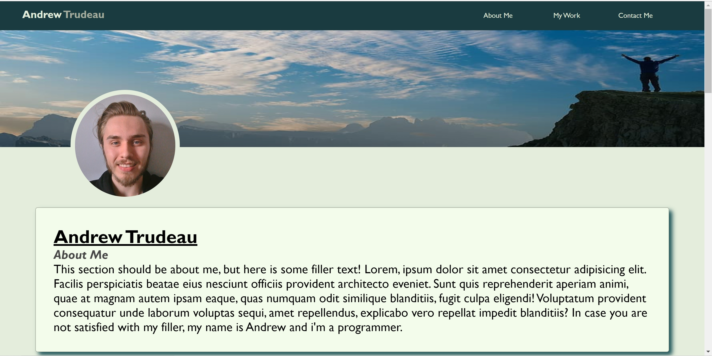
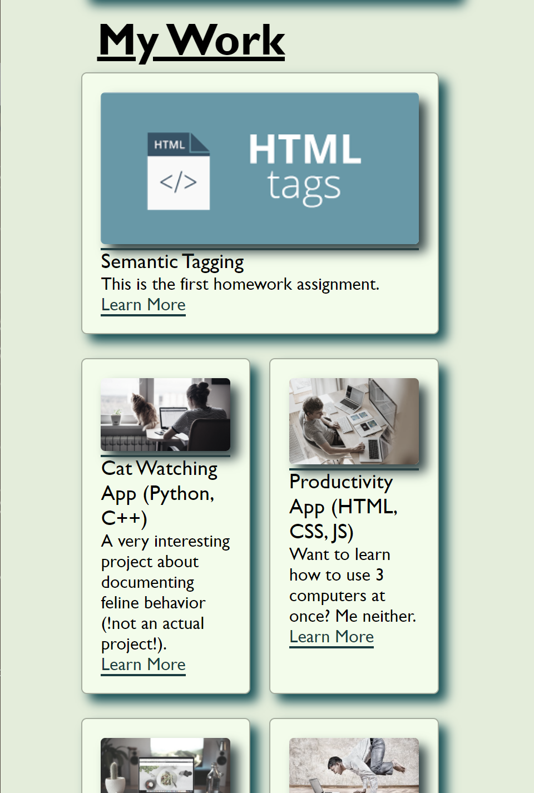

# Homework 2: Advanced CSS Portfolio

## Objective 

This assignment highlights different advanced CSS methods related page resizing, interactive buttons, and other advanced positioning methods like flex.

## Changes

I used the given example to make my own version of a profile/portfolio page. I first sectioned off the html to include a header, a content section (links to 'projects'), and contact information. I then added CSS to accommodate these HTML elements, which included using flex to style the cards. The next step included using the @media tag to adjust the behavior of elements on the screen when resizing occurs. The header links go to their respective sections and all images on the page have appropriate alt tags. I added comments appropriately to all coding files. Note: I was assuming that the content links didn't actually have to go to projects I have made. I understand the utility of accurate portfolio pages, but I think that is more appropriate toward the end of the cohort when there is more content to be shown. The links provided are just filler and thus lead to google.com : ) .

## Screenshots

Header (desktop)

Resized (phone screen)

## Links

[Webpage](https://andrewtrudeau.github.io/advanced-css-portfolio/)

[Github](https://github.com/andrewtrudeau/advanced-css-portfolio)